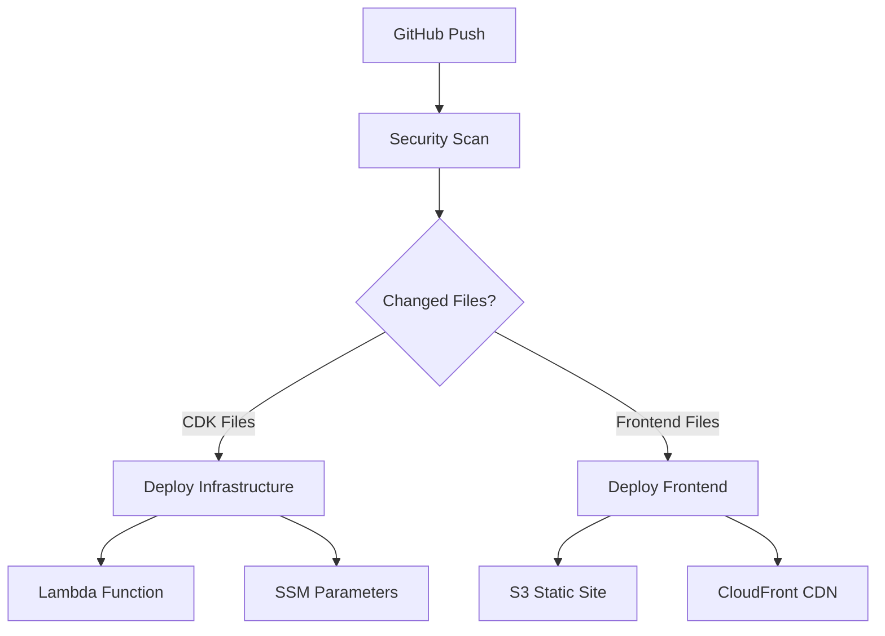

# 🚀 Automated Deployment Guide

This guide covers setting up automated Lambda deployment using GitHub Actions and AWS CDK with secure OIDC authentication.

## 🔐 Security-First Approach

We use **OpenID Connect (OIDC)** instead of long-term AWS credentials for enhanced security:
- ✅ No long-term credentials stored in GitHub
- ✅ Temporary credentials with limited scope
- ✅ Automatic credential rotation
- ✅ Audit trail for all deployments

## 🚀 Quick Setup

### Option 1: Automated OIDC Setup (Recommended)
```bash
# Run the automated setup script
./setup-oidc.sh
```

### Option 2: Manual OIDC Setup

1. **Create OIDC Identity Provider**:
```bash
aws iam create-open-id-connect-provider \
  --url https://token.actions.githubusercontent.com \
  --thumbprint-list 6938fd4d98bab03faadb97b34396831e3780aea1 \
  --client-id-list sts.amazonaws.com
```

2. **Create IAM Role** with trust policy for your repository
3. **Set GitHub Secrets**:
```bash
gh secret set AWS_ROLE_ARN --body "arn:aws:iam::ACCOUNT:role/ROLE_NAME"
gh secret set AWS_ACCOUNT_ID --body "YOUR_ACCOUNT_ID"
```

## 🔄 Deployment Triggers

### Automatic Deployment
The workflow automatically deploys when:
- **Infrastructure**: Changes to `riot-api-cdk/` directory
- **Frontend**: Changes to `rift-rewind-hackathon-aws/` directory
- **Workflow**: Changes to `.github/workflows/deploy.yml`

### Manual Deployment
```bash
# Deploy both infrastructure and frontend
gh workflow run deploy.yml

# Deploy only infrastructure
gh workflow run deploy.yml -f deploy_infrastructure=true -f deploy_frontend=false

# Deploy only frontend
gh workflow run deploy.yml -f deploy_infrastructure=false -f deploy_frontend=true
```

## 🏗️ Deployment Architecture



## 📋 Deployment Steps

### Infrastructure Deployment
1. **Security Scan** - GitLeaks checks for secrets
2. **Environment Setup** - Node.js 18 + Python 3.11
3. **Dependencies** - Install CDK and Lambda packages
4. **CDK Bootstrap** - Initialize CDK in AWS account
5. **CDK Deploy** - Deploy Lambda and infrastructure
6. **Output Capture** - Get Lambda Function URL

### Frontend Deployment
1. **Environment Setup** - Node.js 18 + Yarn cache
2. **Dependencies** - Install React/Vite packages
3. **Build** - Create optimized production bundle
4. **S3 Sync** - Deploy to both paths:
   - `s3://awsaerospace.org/learning/api/`
   - `s3://awsaerospace.org/apitraining/`
5. **CloudFront** - Invalidate cache for updates

## 🔧 Configuration

### Environment Variables
```yaml
AWS_REGION: us-east-2
CDK_DEFAULT_REGION: us-east-2
CDK_DEFAULT_ACCOUNT: ${{ secrets.AWS_ACCOUNT_ID }}
```

### Required Secrets
- `AWS_ROLE_ARN` - IAM role for OIDC authentication
- `AWS_ACCOUNT_ID` - Your AWS account ID

### Optional Secrets (Fallback)
- `AWS_ACCESS_KEY_ID` - For environments without OIDC
- `AWS_SECRET_ACCESS_KEY` - For environments without OIDC

## 🛡️ Security Features

### OIDC Authentication
- **Temporary Credentials** - No long-term keys
- **Scoped Access** - Limited to specific repository
- **Session Names** - Trackable deployment sessions

### Least Privilege IAM
```json
{
  "Effect": "Allow",
  "Action": [
    "cloudformation:*",
    "lambda:*",
    "iam:GetRole",
    "iam:PassRole",
    "ssm:GetParameter",
    "s3:*",
    "cloudfront:CreateInvalidation"
  ]
}
```

### Secret Scanning
- **GitLeaks** - Prevents credential commits
- **Pre-deployment** - Blocks unsafe deployments

## 🔍 Monitoring & Debugging

### Workflow Status
```bash
# Check recent workflow runs
gh run list

# View specific run details
gh run view RUN_ID

# Watch live deployment
gh run watch
```

### AWS Resources
```bash
# Check CDK stack status
aws cloudformation describe-stacks --stack-name RiotApiCdkStack

# View Lambda function
aws lambda get-function --function-name riot-api-function

# Check S3 deployment
aws s3 ls s3://awsaerospace.org/learning/api/
```

## 🚨 Troubleshooting

### Common Issues

**OIDC Authentication Failed**
```bash
# Verify role exists and trust policy is correct
aws iam get-role --role-name GitHubActions-RiftRewind-Role
```

**CDK Bootstrap Required**
```bash
# Bootstrap CDK in your account/region
npx cdk bootstrap aws://ACCOUNT/REGION
```

**Lambda Dependencies Missing**
```bash
# Install dependencies locally first
cd riot-api-cdk/lambda/riot-api-source
pip install aws-xray-sdk -t .
```

**S3 Access Denied**
```bash
# Verify bucket policy allows your role
aws s3api get-bucket-policy --bucket awsaerospace.org
```

### Debug Commands
```bash
# Test AWS credentials
aws sts get-caller-identity

# Validate CDK app
cd riot-api-cdk && npx cdk synth

# Test frontend build
cd rift-rewind-hackathon-aws && yarn build
```

## 📈 Performance Optimizations

### Lambda Cold Starts
- **X-Ray Tracing** - Monitor performance
- **Dependency Optimization** - Minimal package size
- **Environment Variables** - Cached configuration

### Frontend Delivery
- **CloudFront CDN** - Global edge caching
- **Vite Optimization** - Tree shaking and code splitting
- **Asset Compression** - Reduced bundle sizes

## 🔄 Rollback Strategy

### Infrastructure Rollback
```bash
# Rollback CDK stack
aws cloudformation cancel-update-stack --stack-name RiotApiCdkStack
```

### Frontend Rollback
```bash
# Restore previous S3 version
aws s3api list-object-versions --bucket awsaerospace.org --prefix learning/api/
aws s3api restore-object --bucket awsaerospace.org --key learning/api/index.html --version-id VERSION_ID
```

## 📚 Additional Resources

- [AWS CDK Best Practices](https://docs.aws.amazon.com/cdk/v2/guide/best-practices.html)
- [GitHub Actions Security](https://docs.github.com/en/actions/security-guides)
- [OIDC with AWS](https://aws.amazon.com/blogs/security/use-iam-roles-to-connect-github-actions-to-actions-in-aws/)
- [Lambda Deployment Guide](https://docs.aws.amazon.com/lambda/latest/dg/deploying-github-actions.html)